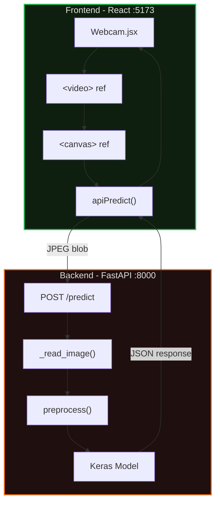

# Component Architecture

Shows the React frontend and FastAPI backend components and their interactions.

**Flow:**
1. User starts camera in Webcam.jsx
2. Every 100-200ms, canvas captures video frame
3. apiPredict() sends JPEG blob to backend
4. Backend processes and returns prediction
5. UI updates with results
