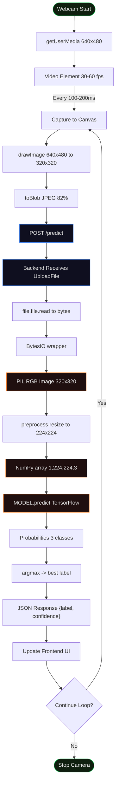

```mermaid
flowchart TD
    Start([Webcam Start]) --> GetStream["getUserMedia 640x480"]
    GetStream --> VideoEl["Video Element 30-60 fps"]

    VideoEl -->|Every 100-200ms| Capture["Capture to Canvas"]
    Capture --> Draw["drawImage 640x480 to 320x320"]
    Draw --> Encode["toBlob JPEG 82%"]

    Encode --> Send["POST /predict"]
    Send --> Receive["Backend Receives UploadFile"]
    Receive --> Read["file.file.read to bytes"]
    Read --> BytesIO["BytesIO wrapper"]
    BytesIO --> PIL["PIL RGB Image 320x320"]

    PIL --> Preprocess["preprocess resize to 224x224"]
    Preprocess --> NPArray["NumPy array 1,224,224,3"]

    NPArray --> Predict["MODEL.predict TensorFlow"]
    Predict --> Probs["Probabilities 3 classes"]

    Probs --> ArgMax["argmax -> best label"]
    ArgMax --> Response["JSON Response {label, confidence}"]

    Response --> Update["Update Frontend UI"]
    Update --> Next{Continue Loop?}
    Next -->|Yes| Capture
    Next -->|No| End([Stop Camera])

    style Start fill:#0f1f0f,stroke:#22c55e,color:#e0e0e0
    style End fill:#0f1f0f,stroke:#22c55e,color:#e0e0e0
    style Send fill:#0f0f1f,stroke:#3b82f6,color:#e0e0e0
    style Receive fill:#0f0f1f,stroke:#3b82f6,color:#e0e0e0
    style PIL fill:#1f0f0f,stroke:#f97316,color:#e0e0e0
    style NPArray fill:#1f0f0f,stroke:#f97316,color:#e0e0e0
    style Predict fill:#1f0f0f,stroke:#f97316,color:#e0e0e0
```