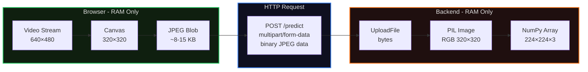

# Memory Storage Flow

Shows how image data flows through RAM only - no disk writes at any point.

**Key Points:**
- All data remains in memory at every stage
- No temporary files written to disk
- Browser garbage collects Blob after request
- Backend garbage collects PIL/NumPy objects after response
