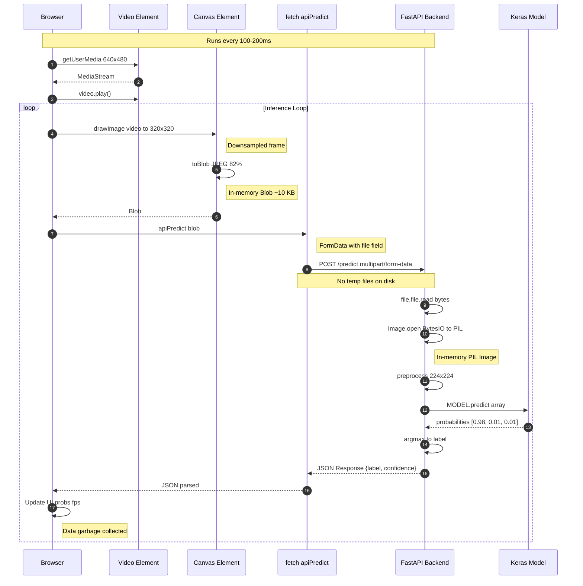

```mermaid
sequenceDiagram
    autonumber
    participant Browser as Browser
    participant Video as Video Element
    participant Canvas as Canvas Element
    participant API as fetch apiPredict
    participant Backend as FastAPI Backend
    participant Model as Keras Model

    Note over Browser,Backend: Runs every 100-200ms

    Browser->>Video: getUserMedia 640x480
    Video-->>Browser: MediaStream
    Browser->>Video: video.play()

    loop Inference Loop
        Browser->>Canvas: drawImage video to 320x320
        Note right of Canvas: Downsampled frame

        Canvas->>Canvas: toBlob JPEG 82%
        Note right of Canvas: In-memory Blob ~10 KB
        Canvas-->>Browser: Blob

        Browser->>API: apiPredict blob
        Note right of API: FormData with file field

        API->>Backend: POST /predict multipart/form-data
        Note over API,Backend: No temp files on disk

        Backend->>Backend: file.file.read bytes
        Backend->>Backend: Image.open BytesIO to PIL
        Note right of Backend: In-memory PIL Image

        Backend->>Backend: preprocess 224x224
        Backend->>Model: MODEL.predict array
        Model-->>Backend: probabilities [0.98, 0.01, 0.01]

        Backend->>Backend: argmax to label

        Backend-->>API: JSON Response {label, confidence}
        API-->>Browser: JSON parsed

        Browser->>Browser: Update UI probs fps

        Note right of Browser: Data garbage collected
    end
```